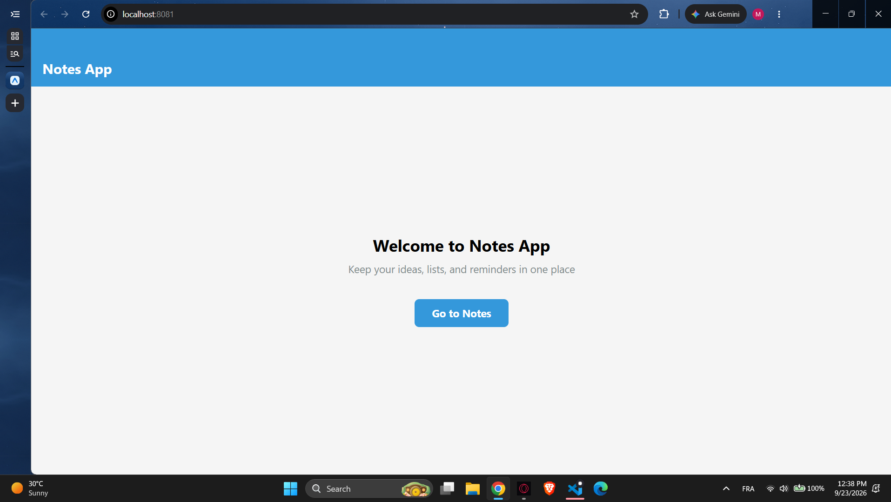
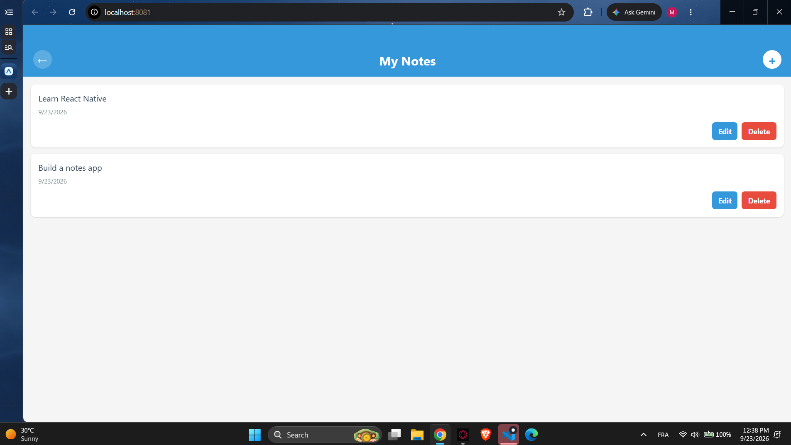
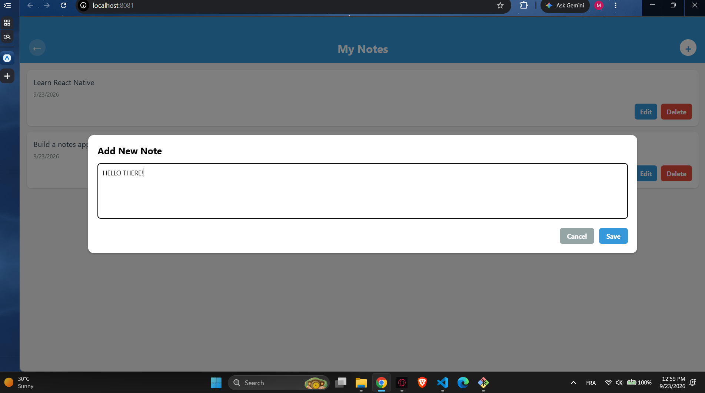

# 📝 Notes App — Flutter Mobile Development Lab

A simple notes app built with Flutter/Dart as a first step into mobile development, coming from a full-stack web background. Create, edit, and delete notes — deployed both as a web app and a native Android app.

## 🚀 Live Demo

- **Web version:** [manar09-code.github.io/Mobile_Labs](https://manar09-code.github.io/Mobile_Labs/)
- **Android APK:** available as a downloadable build artifact from the [Build APK workflow](../../actions/workflows/build-apk.yml)

## ✨ Features

- Add, edit, and delete notes
- Simple, clean navigation between Home and Notes screens
- Responsive layout across web and mobile

## 🛠️ Tech Stack

- **Framework:** Flutter (Dart)
- **Deployment:** GitHub Pages (web) + manual APK sideload (Android)
- **CI/CD:** GitHub Actions — automated build & deploy on every push to `main`

## 📱 Screenshots

### Web App
| Home | Notes | Add Note |
|------|-------|----------|
|  |  |  |

### Mobile App
See `screenrecord_mobile_app/` for a screen recording of the app running on a physical Android tablet.

## ⚙️ Getting Started Locally

```bash
cd notes_app
flutter pub get
flutter run -d chrome        # run in browser
flutter build web --release --base-href "/Mobile_Labs/"   # build for web
flutter build apk --release  # build Android APK
```

## 🔄 CI/CD

This repo uses two GitHub Actions workflows:

- **`deploy.yml`** — builds the Flutter web app and deploys it to GitHub Pages automatically on every push to `main`
- **`build-apk.yml`** — builds a release Android APK on manual trigger, available for download under the Actions tab

## 👩‍💻 Author

**Manar Degachi**
Software Development student — ISET Tozeur, Tunisia
